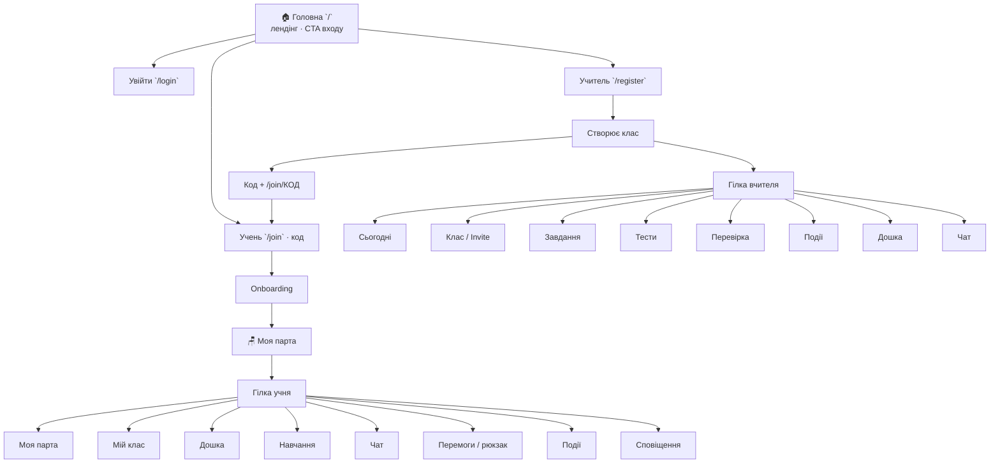

# Дерево продукту (Mermaid / текст)

> Дзеркало презентації в `index.html`. Канон рішень — `.cursor/PROJECT_CHAIN.md`.

## Схема



## Головна

- Показує ідею: «У кожного є своя парта…»
- Шляхи: увійти / стати вчителем / є код класу
- Не LMS і не електронний щоденник

## Учитель — підгілки

| Підгілка | Що вміє |
|----------|---------|
| **Сьогодні** | Дашборд: нові роботи, подія, прогрес, бейджі |
| **Клас / Invite** | Створити клас, код/лінк, regenerate, склад |
| **Завдання** | Створити / видалити HW, повʼязати з тестом |
| **Тести** | База шаблонів + свій тест + видалення |
| **Перевірка** | Коментар → прийняти / доопрацювання / redo тест |
| **Події** | Початок/кінець; після кінця — учасники, ревʼю, пост на дошку |
| **Дошка** | Приховати пост (публікації йдуть одразу) |
| **Чат** | Клас + особисті з учнями |

## Учень — підгілки (від класу вчителя)

| Підгілка | Що вміє |
|----------|---------|
| **Моя парта** | Дім: XP, день, подія, мета класу |
| **Мій клас** | Однокласники, учитель, дошка, події |
| **Дошка** | Пости одразу, реакції |
| **Навчання** | ДЗ, тести, квести, «що пропустив?» |
| **Чат** | Клас + DM з учнями / учителем |
| **Перемоги / рюкзак** | Досягнення, стікери, рівні без втрати XP |
| **Події** | Join поки триває; підсумок на дошці |
| **Сповіщення** | Нове + бейджі навігації |

## Ланцюг доступу (канон)

```
Учитель /register
  → створює клас
  → код /join/КОД
  → учень (+батьки лише допомагають)
  → onboarding
  → Моя парта
  → спільне життя класу
```

**Не в MVP:** батьківський кабінет, school admin, рейтинги між дітьми.
